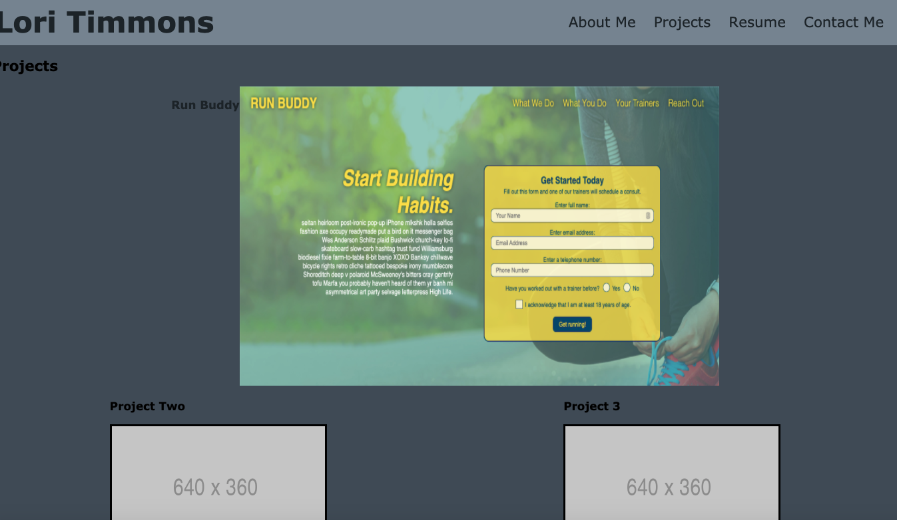

Lori Timmons

Week 2: Advanced CSS Challenge: Professional Portfolio

Project Description:
I have created a responsive online professional portfolio to all employers to view my projects. This portfolio incudes a responsive layout, sticky header, overlay text and working links. I have also included a link to my linkedin profile and contact information. 

Links: 
URL to deployed application: https://loritimmons.github.io/homeworkweek2/

The URL of the GitHub repository: https://github.com/LoriTimmons/homeworkweek2

